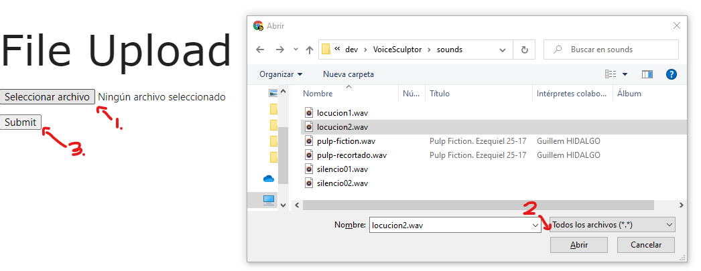

# Voice Sculptor : TFG

## Start Project

### Windows
- Install Python 3.8
Preferred method of install is via [chocolatey](https://chocolatey.org/install), a Windows package manager.

Install chocolatey
```shell
Set-ExecutionPolicy Bypass -Scope Process -Force; [System.Net.ServicePointManager]::SecurityProtocol = [System.Net.ServicePointManager]::SecurityProtocol -bor 3072; iex ((New-Object System.Net.WebClient).DownloadString('https://community.chocolatey.org/install.ps1'))
```
Install python 3.8
```shell
choco install python --version=3.8.0
```
But could also be done with [Anaconda](https://www.anaconda.com/products/individual)

```bash
py -m ensurepip --upgrade
pip install wheel
pip install PyAudio-0.2.11-cp38-cp38-win_amd64
```

### Unix
```bash
sudo apt-get install python3.8
```

## Install required libraries

```bash
pip install -r requirements.txt
```

## Use Guide

### Deferred Report

Enter to the folder "deferred_report" and run:
```bash
python report_deferred.py
```
Then access to localhost in port 5000:

[http://127.0.0.1:5000/](http://127.0.0.1:5000/)

Upload a file in .wav or .mp3 format


## Stream Analyzer
Enter to the folder "stream_analyzer" and run:
```bash
python main.py
```
Then access to localhost in port 5050:

[http://127.0.0.1:5050/](http://127.0.0.1:5050/)

Click on the 'play' button to start recording and analyzing your speech.


### Change settings

To change settings for the stream analyzer app enter .env file and change the following values:

```env
SECS=15
SAMPLE_RATE=44100
FPS=1
```

This are the ones that work fine by default.

## Report

Uses a Flask server to show the transcription and information about pauses, speech rate, intensity and pitch.

## Live Audio

Uses PyAudio callback to save audio chunks in a variable circular buffer.
A Dash web server plots the information stored in a common folder. Plots information about pauses, syllables, speech rate, intensity and pitch.

## Parselmouth Performance

```python
In[1] %timeit snd = parselmouth.Sound("holamesa.wav")
170 µs ± 3.22 µs per loop (mean ± std. dev. of 7 runs, 10000 loops each)

In [2]: snd.duration
Out[2]: 1.6370068027210884

In [3]: %timeit snd.to_pitch()
9.26 ms ± 94.3 µs per loop (mean ± std. dev. of 7 runs, 100 loops each)

In [4]: %timeit snd.to_intensity()
2.08 ms ± 5.26 µs per loop (mean ± std. dev. of 7 runs, 100 loops each)

------------

In [1]: %timeit snd = parselmouth.Sound("locucion2.wav")
10.7 ms ± 87.9 µs per loop (mean ± std. dev. of 7 runs, 100 loops each)

In [2]: snd.duration
Out[2]: 36.288

In [3]: %timeit snd.to_pitch()
64.9 ms ± 866 µs per loop (mean ± std. dev. of 7 runs, 10 loops each)

In [4]: %timeit snd.to_intensity()
52.3 ms ± 208 µs per loop (mean ± std. dev. of 7 runs, 10 loops each)

------------

In [1]: %timeit snd = parselmouth.Sound("00017.wav")
99.7 ms ± 1.21 ms per loop (mean ± std. dev. of 7 runs, 10 loops each)

In [2]: snd.duration
Out[2]: 314.624

In [3]: %timeit snd.to_pitch()
503 ms ± 8.15 ms per loop (mean ± std. dev. of 7 runs, 1 loop each)

In [4]: %timeit snd.to_intensity()
447 ms ± 595 µs per loop (mean ± std. dev. of 7 runs, 1 loop each)
```
